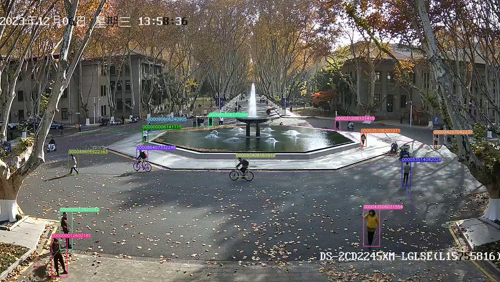

# 简介
## 概述
相比于以往的 yolo+deepsort 方法，可以实现多视频、跨镜头、长时空间跨度的人物重识别，生成基于输入视频的轨迹视频和视角转换后的轨迹视频

## 流程图


## 主要过程
在ultralytics/yolo/v8/detect目录下：
- 利用 yolo + deepsort 对视频中的人物进行识别，进行初步的 reID，并提取人物图片到 ./data/Small_Scenes_1，将初步识别的人物 position 和 id 记录在 ./reID 中
- 利用 Vit 对提取出的人物图片进行特征提取，记录在 ./feats 中
- 利用余弦相似度将首次出现的人物 id 与既往进行匹配，对人物进行进一步的重识别，识别结果放入 ./reID_new 中
- 输出透视视角下的人物轨迹，视频在 ./runs/detect

# 执行
## 创建虚拟环境
按 ultralytics/yolo/v8/detect/requirement/smallscene.txt 的内容，创建名为 smallscene 的虚拟环境

## 准备

### 下载链接
下载 bounding_box_train_100.zip 到 ultralytics/yolo/v8/detect/data/Small_Scenes 中，并解压.
链接：https://drive.google.com/file/d/1YElOXJKCpK85kaiYTLjZ6GdkUby1uw7G/view?usp=drive_link

下载 transformer_100.pth 到 ultralytics/yolo/v8/detect/logs/duke_vit_transreid_stride 中.
链接：https://drive.google.com/file/d/1UoerBon_hyGEXAyIVLWO4aky_WaX30Mp/view?usp=drive_link

下载 vit_small_p16_224-15ec54c9.pth 到 ultralytics/yolo/v8/detect/model 中.
链接：https://drive.google.com/file/d/1bSmU39XlmQiaDxOQuvU4zwdpRnC__TaT/view?usp=drive_link

### 待处理视频
将需要进行识别的视频 test.mp4 放在 ultralytics/yolo/v8/detect 目录下，并将 small_scene.sh 中的 video_file 修改为 "test.mp4"

### 视角转换（非必须）
在 ultralytics/yolo/v8/detect/reID.py 文件下，A 为透视视角的图片中的四个点坐标，B 为俯视视角下的图片中与 A 一一对应的四个点的坐标。

A 为 ultralytics/yolo/v8/detect/images/2.png, B 为 ultralytics/yolo/v8/detect/images/1.png
<div style="display:flex; flex-wrap:wrap;">
    
    
</div>

```
# B = M * A，获得透视转换矩阵 M
A = [(520, 760), (1720, 870), (870, 870), (1290, 700)]
B = [(1078, 568), (791, 449), (963, 449), (871, 649)]
```
对于不同的视频，需要替换对应的不同视角的图片 和 reID.py 下 A 与 B 的值

## 重识别
可以在 linux 环境下或 git bash 终端中运行 sh 文件
```
cd ./ultralytics/yolo/v8/detect
./small_scene.sh
```
## 运行结果
- 输出透视视角下的人物轨迹，视频在 ./runs/detect
- 输出俯视视角下的人物轨迹，视频 output_vedio.mp4 在 ./ 中

### 结果展示
<div style="display:flex; flex-wrap:wrap;">
    
    
</div>

## 附
如果需要自己训练 vit 模型 transformer_100.pth，训练流程、数据集和配置文件修改可以查看[TransReID](ultralytics/yolo/v8/detect/TransReID-main/README.md)

Yolov8 的相关训练和使用细节，可以查看[YOLOv8](README_old.md)