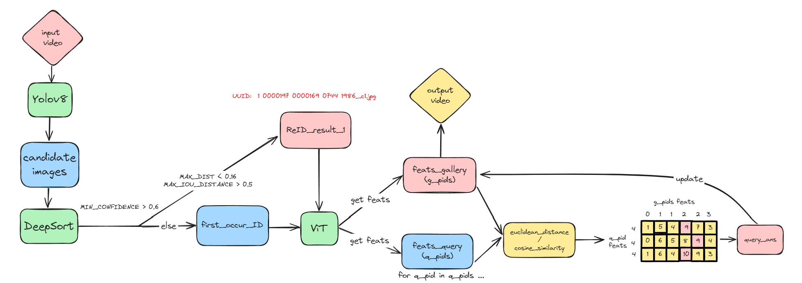
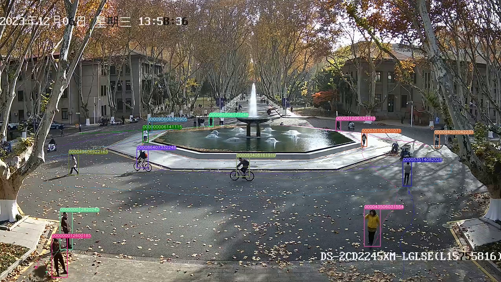
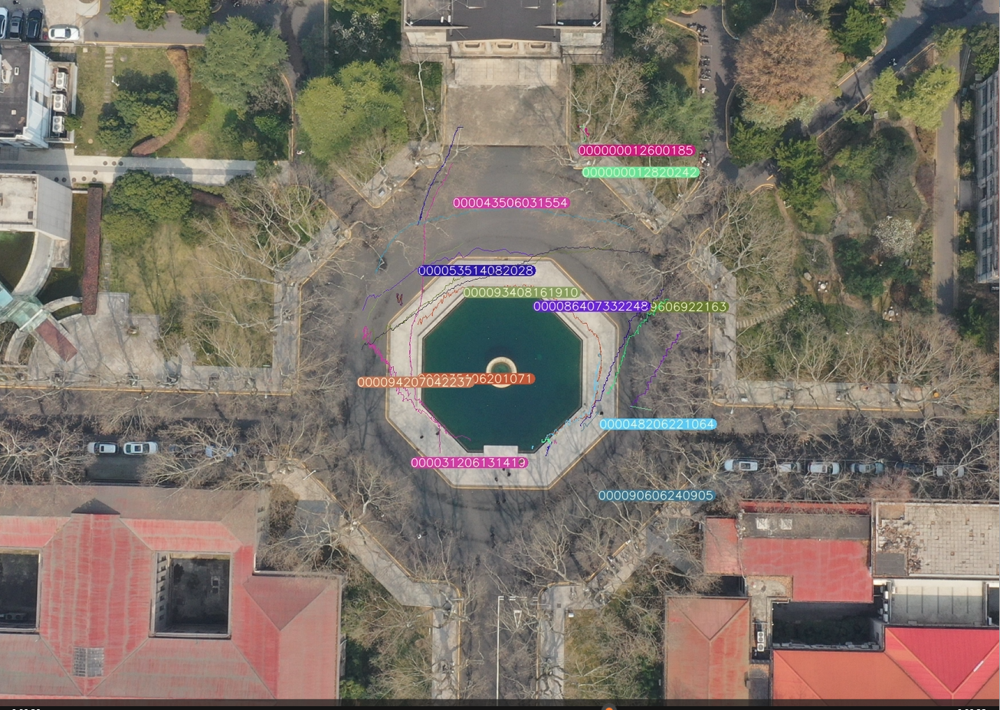

# Introduction
## Overview
Compared with the previous method of YOLO+DeepSORT, it can achieve multi-video, cross-camera, long-term space span person re-identification, and generate trajectory videos based on input videos and trajectory videos after perspective transformation.

## Flowchart


## Main process
In the ultralytics/yolo/v8/detect directory:
- Use yolo + deepsort to identify the people in the video, perform a preliminary reID, extract the person picture to ./data/Small_Scenes_1, and record the position and id of the preliminarily recognized person in ./reID
- Use Vit to extract features from the extracted people and record them in ./fets
- Use cosine similarity to match the ID of the first person with the previous one, further re-identify the person, and put the recognition result into ./reID_new
- Output the person's trajectory from perspective view, and the video is displayed in ./runs/detect

# Execute
## Create a virtual environment
Press Ultralytics/Yolo/V8/Detect/Requirement/smallscene.txt to create a virtual environment called SmallScene

## Prepare

### Download link
Download [bounding_box_train_100.zip](https://drive.google.com/file/d/1YElOXJKCpK85kaiYTLjZ6GdkUby1uw7G/view?usp=drive_link) to ultralytics/yolo/v8/detect/data/Small_Scenes.

Download [transformer_100.pth](https://drive.google.com/file/d/1UoerBon_hyGEXAyIVLWO4aky_WaX30Mp/view?usp=drive_link) to ultralytics/yolo/v8/detect/logs/duke_vit_transreid_stride.

Download [vit_small_p16_224-15ec54c9.pth](https://drive.google.com/file/d/1bSmU39XlmQiaDxOQuvU4zwdpRnC__TaT/view?usp=drive_link) into ultralytics/yolo/v8/detect/model.

### Inuput video
Put the video test.mp4 that needs to be recognized in the ultralytics/yolo/v8/detect directory, and change the video_file in the small_scene.sh to "test.mp4"

### Perspective Shift (Optional)
In the ultralytics/yolo/v8/detect/reID.py file, A is the coordinates of the four points in the perspective view, and B is the coordinates of the four points corresponding to A in the top-down view.

A is ultralytics/yolo/v8/detect/images/2.png, B is ultralytics/yolo/v8/detect/images/1.png
<div style="display:flex; flex-wrap:wrap;">
    
    
</div>

```
# B = M * A，Obtain the perspective transformation matrix M
A = [(520, 760), (1720, 870), (870, 870), (1290, 700)]
B = [(1078, 568), (791, 449), (963, 449), (871, 649)]
```
For different videos, you need to replace the values of A and B in the corresponding images from different perspectives and reID.py

## ReID
You can run sh files in a Linux environment or in a Git Bash terminal
```
cd ./ultralytics/yolo/v8/detect
./small_scene.sh
```
## Results
- Output the person's trajectory from perspective view, and the video is displayed in ./runs/detect
- Output the person's trajectory from a top-down view, video output_vedio.mp4 in ./

### Display
<div style="display:flex; flex-wrap:wrap;">
    
    
</div>

## Attached
If you need to train the vit model transformer_100.pth by yourself, you can see [TransReID](ultralytics/yolo/v8/detect/TransReID-main/README.md) for training process, dataset, and configuration file modifications.

For more information on the training and use of Yolov8, please refer to [YOLOv8](README_old.md)